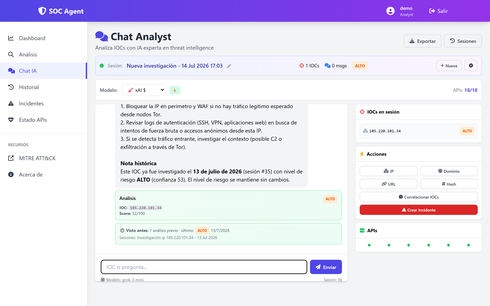
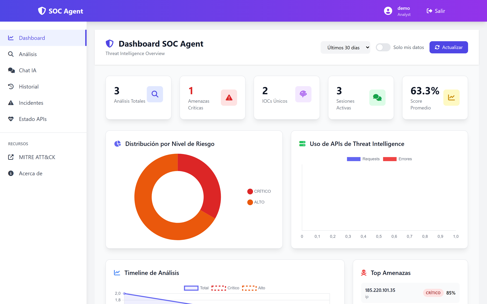
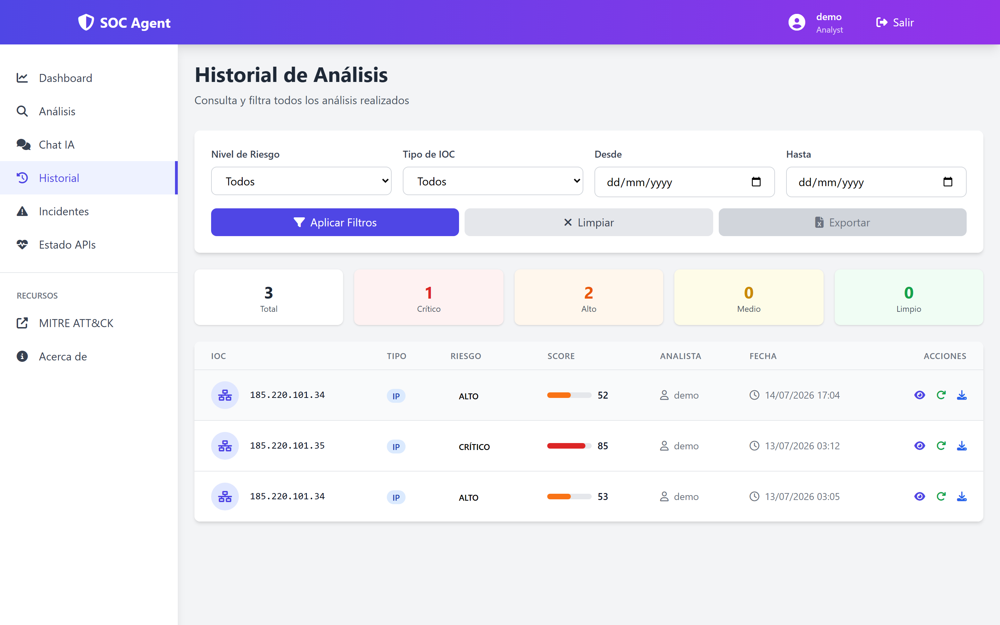

<div align="center">

# SOC Agent

### AI-Powered Threat Intelligence Platform for SOC Analysts

[](https://github.com/cc22n/SOC-Assistan/actions/workflows/ci.yml)


*Analyze IOCs, generate professional reports, and manage security incidents from a single interface.*

[Spanish Version / Version en Espanol](README.es.md)

</div>

---

## What is SOC Agent?

SOC Agent is a web-based threat intelligence platform designed for Security Operations Center (SOC) analysts. It integrates **19 threat intelligence APIs**, **web OSINT search (Tavily)** and **5 LLM providers** to analyze Indicators of Compromise (IOCs) such as IPs, domains, hashes, and URLs.

The system enables analysts to:
- Analyze IOCs against multiple sources simultaneously
- Get AI-powered intelligent analysis with automatic LLM routing
- Chat with an AI SOC assistant that remembers past investigations and correlates threats
- Run deep analysis with a 2-step web search agent (LLM-planned queries + cited synthesis)
- Manage incidents with Kanban board and timeline views
- Whitelist known false positives so they skip analysis
- Generate professional reports in PDF and DOCX formats
- Correlate IOCs with MITRE ATT&CK techniques
- Monitor API health, circuit breakers, and performance metrics in real time

---

## Screenshots

**AI chat analyzing an IOC** — 18 threat-intel APIs + LLM synthesis, with cross-session memory ("Seen before" badge links to the previous investigation):



**Dashboard** — risk distribution, analysis timeline and top threats:



**Analysis history** — filterable, exportable, per-analyst:



---

## Architecture

```
┌─────────────────────────────────────────────────────────────┐
│                         Frontend                             │
│  Dashboard │ Analysis │ Chat │ Incidents │ Reports │ Health  │
│              (Jinja2 + Tailwind + Chart.js)                  │
├─────────────────────────────────────────────────────────────┤
│                      Flask Backend                            │
│  ┌──────────┐  ┌──────────┐  ┌────────────────────────┐    │
│  │ Auth     │  │ API v2   │  │ Security Middleware     │    │
│  │ (RBAC,   │  │ Routes   │  │ (Anti-SQLi, XSS,       │    │
│  │ Audit)   │  │          │  │  Prompt Injection)     │    │
│  └──────────┘  └──────────┘  └────────────────────────┘    │
│  ┌─────────────────────────────────────────────────────┐    │
│  │                   Services Layer                     │    │
│  │  LLM Orchestrator (smart routing)  │ Session Manager │    │
│  │  Threat Intel + Circuit Breakers   │ Report Generator│    │
│  │  IOC Cache (TTL by type & risk)    │ Metrics Engine  │    │
│  └─────────────────────────────────────────────────────┘    │
├─────────────────────────────────────────────────────────────┤
│  ┌──────────────┐  ┌────────────────────────────────────┐   │
│  │ PostgreSQL   │  │ 19 Threat Intel APIs               │   │
│  │ (Users,      │  │ VirusTotal, AbuseIPDB, Shodan,     │   │
│  │  IOCs,       │  │ GreyNoise, OTX, ThreatFox,         │   │
│  │  Analyses,   │  │ URLhaus, MalwareBazaar,             │   │
│  │  Incidents,  │  │ SecurityTrails, Pulsedive, ...      │   │
│  │  Audit Log,  │  └────────────────────────────────────┘   │
│  │  Sessions)   │  ┌────────────────────────────────────┐   │
│  └──────────────┘  │ 5 LLM Providers                    │   │
│                    │ xAI · OpenAI · Groq · Gemini        │   │
│                    │ Anthropic (Claude)                  │   │
│                    └────────────────────────────────────┘   │
└─────────────────────────────────────────────────────────────┘
```

---

## Integrated APIs

### Threat Intelligence (19)

| Category | APIs |
|----------|------|
| **Reputation** | VirusTotal, AbuseIPDB, GreyNoise, Pulsedive |
| **Infrastructure** | Shodan, Shodan InternetDB, Criminal IP, SecurityTrails, Censys |
| **Malware** | ThreatFox, MalwareBazaar, Hybrid Analysis |
| **URLs** | URLhaus, URLScan, Google Safe Browsing |
| **Intelligence** | AlienVault OTX |
| **Geolocation** | IP-API (no key required), IPinfo, IPGeolocation.io |
| **Web OSINT** | Tavily Search (LLM-oriented web search, used by Deep Analysis) |

### LLM Providers (5)

| Provider | Model | Best For |
|----------|-------|----------|
| **xAI** | Grok-3-mini | Fast analysis, default |
| **OpenAI** | GPT-4o-mini | Deep analysis, hashes |
| **Groq** | LLaMA 3.3 70B | Speed, free tier |
| **Gemini** | Gemini 2.5 Flash | Long context, free tier |
| **Anthropic** | Claude Sonnet 4.6 | Advanced reasoning |

The orchestrator automatically routes each analysis to the optimal provider based on IOC type and analysis depth (e.g. Groq for IPs, OpenAI/Anthropic for malware hashes).

---

## Features

### IOC Analysis
- Simultaneous analysis against multiple APIs
- Automatic IOC type detection (IP, domain, hash, URL)
- Confidence score and risk level (CRITICAL, HIGH, MEDIUM, LOW, CLEAN)
- Automatic MITRE ATT&CK technique mapping
- Smart LLM routing: provider selected automatically by IOC type and depth
- Pydantic validation of all API responses (detects unexpected schema changes)
- IOC whitelist: known false positives skip analysis (managed via API, audited)

### AI SOC Chat
- Investigation assistant with persistent context
- Investigation sessions with full history and auto-compressed summaries
- **Cross-session memory**: warns when an IOC was already investigated before (when, risk, in which investigation)
- **Threat correlation graph**: flags previous IOCs sharing malware family, MITRE techniques, ASN or incident ("possible same campaign") — pure SQL, no LLM cost
- Smart re-query: if a question needs data not yet fetched, only the missing APIs are called and results are persisted
- Session export (JSON, Markdown, PDF, DOCX)
- LLM provider selector (xAI, OpenAI, Groq, Gemini, Claude)

### Deep Analysis + Web OSINT Agent
- Full pipeline: 19 APIs + web search + IOC correlation + APT attribution + attack hypothesis
- **2-step web search agent**: an LLM plans targeted queries from API findings (malware family, ASN — not the raw IOC), Tavily searches with extracted page content restricted to trusted security domains, and a second LLM synthesizes findings **with mandatory citations**
- Broad-retry fallback when targeted queries find nothing; static fallback when no LLM is available
- Web content treated as untrusted (anti prompt-injection guard); claims without a source are not asserted
- Web search results cached in PostgreSQL with 24h TTL (saves Tavily credits and LLM calls)

### Incident Management
- Kanban board view (Open, Investigating, Resolved, Closed)
- Integrated timeline with chat messages
- Multiple IOCs linked per incident (pivot table)
- Auto-generated ticket IDs (SOC-YYYYMMDD-NNN)
- Quick creation from analysis or chat
- Paginated API with ownership verification (IDOR protection)

### Dashboard
- Real-time statistics with charts
- Risk distribution, temporal trends
- Recent IOCs and open incidents
- Top analyzed IOCs

### API Health Dashboard (`/api-health`)
- Unified view of API quotas (used / remaining today) and circuit breaker states
- Circuit breakers per API: CLOSED / OPEN / HALF-OPEN with failure count and retry timer
- Top 5 slowest APIs by P95 latency with visual bars
- HTTP endpoint latency table (P50 / P95 / P99 / avg / error rate)
- Auto-refresh every 30 seconds

### Reports
- Professional PDF generation with ReportLab
- Editable DOCX generation with python-docx
- Executive summary, IOCs, MITRE ATT&CK, recommendations
- Optional raw API data per IOC (`?include_api_details=true`) in both PDF and DOCX

### Security
- Authentication with Flask-Login + password hashing (Werkzeug)
- RBAC with 4 roles: `viewer`, `analyst`, `senior_analyst`, `admin`
- Admin-only user creation (first user bootstraps as admin; role assigned at creation)
- CSRF protection on all forms
- Rate limiting by IP and endpoint
- Anti-injection middleware (SQLi, XSS, Command Injection, Path Traversal)
- **Prompt injection protection** — 15 patterns blocked before sending to LLM
- Security headers (CSP, X-Frame-Options, HSTS, etc.)
- Session hardening (HttpOnly, SameSite, timeout)
- **Append-only audit log** — every login, analysis, and access denial recorded
- Request size limit (16 MB) with proper 413 handler

### Observability
- **Structured JSON logging** with correlation ID per request
- **In-memory sliding window metrics** (P50/P95/P99) without external dependencies
- Circuit breaker pattern for all external APIs (CLOSED → OPEN → HALF-OPEN)
- TTL cache differentiated by IOC type (IP: 1h, URL: 1h, domain: 6h, hash: 24h)
- Compound PostgreSQL indexes for high-cardinality queries
- Full OpenAPI spec at `/api/v2/openapi.json`

---

## Installation

### Quick Start (Docker)

The fastest way to try SOC Agent — no local Python or PostgreSQL needed:

```bash
git clone https://github.com/cc22n/SOC-Assistan.git
cd SOC-Assistan

# Optional but recommended: API keys + SECRET_KEY for the container
cp .env.example .env.docker
# Edit .env.docker: set SECRET_KEY (32+ chars) and any API keys you have

docker compose up --build
```

Then open `http://localhost:5000`. The app container waits for PostgreSQL, creates the schema automatically (`db.create_all()` + performance indexes) and starts gunicorn. The first registered user becomes administrator.

> Note: without API keys the app runs, but IOC lookups will return empty results. `DATABASE_URL`, `REDIS_URL` and `FLASK_ENV` are set by `docker-compose.yml` and always point to the bundled services.

#### TLS in production

`docker-compose.yml` exposes the app container on port 5000 over plain HTTP — gunicorn does not terminate TLS itself. `ProductionConfig` sets `SESSION_COOKIE_SECURE=True`, which means the browser will not send the session cookie back over an insecure connection, so the app must sit behind something that terminates HTTPS before traffic reaches gunicorn. Put a reverse proxy (nginx, Caddy) or a managed load balancer in front of the container to handle the TLS certificate and forward plain HTTP to `localhost:5000` internally, or terminate TLS at a service like Cloudflare in front of the deployment. Exactly how you configure that proxy depends on your environment, so it's not covered step by step here.

### Manual installation

### Prerequisites

- Python 3.10+
- PostgreSQL 14+
- Git

### 1. Clone the repository

```bash
git clone https://github.com/your-username/soc-agent.git
cd soc-agent
```

### 2. Create virtual environment

```bash
python -m venv venv

# Windows
venv\Scripts\activate

# Linux/Mac
source venv/bin/activate
```

### 3. Install dependencies

```bash
pip install -r requirements.txt
```

### 4. Configure environment variables

```bash
cp .env.example .env
# Edit .env with your API keys and configuration
```

### 5. Set up PostgreSQL

```sql
CREATE DATABASE soc_agent;
CREATE USER soc_admin WITH PASSWORD 'your_secure_password';
GRANT ALL PRIVILEGES ON DATABASE soc_agent TO soc_admin;
```

### 6. Initialize database

```bash
flask db upgrade

# Apply performance and audit migrations:
psql -U soc_admin -d soc_agent -f migrations/add_performance_indexes_and_audit.sql
```

### 7. Run the application

```bash
# Development
flask run --debug

# Production
gunicorn -w 4 -b 0.0.0.0:5000 wsgi:app
```

### 8. Create an account

Navigate to `http://localhost:5000/auth/register`. The **first registered user becomes administrator** (bootstrap). After that, registration is admin-only: administrators create new users and assign their role from the same form.

---

## API Configuration

You don't need all APIs to use SOC Agent. The system works with whatever APIs you have available. Recommended free APIs to get started:

| API | Free Tier | Sign Up |
|-----|-----------|---------|
| VirusTotal | 500 req/day | [virustotal.com](https://www.virustotal.com/gui/join-us) |
| AbuseIPDB | 1000 req/day | [abuseipdb.com](https://www.abuseipdb.com/register) |
| GreyNoise | Community | [greynoise.io](https://viz.greynoise.io/signup) |
| AlienVault OTX | Unlimited | [otx.alienvault.com](https://otx.alienvault.com/api) |
| Shodan InternetDB | No key required | — |
| IP-API | No key required | — |
| URLhaus | No key required | — |
| ThreatFox | No key required | — |
| MalwareBazaar | No key required | — |
| IPGeolocation.io | 1000 req/day | [ipgeolocation.io](https://ipgeolocation.io/signup.html) |
| Tavily (web OSINT) | 1000 credits/month | [tavily.com](https://app.tavily.com/) |

For LLMs, [Groq](https://console.groq.com/) offers free access. [Anthropic](https://console.anthropic.com/) and [OpenAI](https://platform.openai.com/) are paid.

---

## Project Structure

```
soc-agent/
├── app/
│   ├── __init__.py              # Factory pattern, JSON logging, metrics hook
│   ├── config.py                # Environment-based config, LLM models
│   ├── middleware/
│   │   └── security.py          # Anti-SQLi, XSS, validation
│   ├── models/
│   │   ├── ioc.py               # User, IOC, IOCAnalysis, Incident
│   │   ├── session.py           # InvestigationSession, SessionIOC
│   │   ├── mitre.py             # MITRE ATT&CK mappings
│   │   └── audit.py             # AuditEvent, @audit_action decorator
│   ├── routes/
│   │   ├── main.py              # Main views + unified API health dashboard
│   │   ├── auth.py              # Login, register, profile (with audit log)
│   │   ├── api_v2_routes.py     # REST API (analysis, chat, sessions, health)
│   │   ├── incident_routes.py   # Incident CRUD with pagination + IDOR checks
│   │   ├── dashboard_routes.py  # Dashboard stats API
│   │   ├── report_routes.py     # Report generation
│   │   └── mitre_stix_routes.py # MITRE + STIX export (RBAC protected)
│   ├── schemas/
│   │   ├── api.py               # Request schemas (Pydantic v2)
│   │   └── api_responses.py     # Response schemas for TI APIs
│   ├── services/
│   │   ├── new_api_clients.py   # 19 API clients + Tavily, with circuit breakers
│   │   ├── llm_orchestrator.py  # Smart LLM routing, chat memory + correlation graph
│   │   ├── deep_analysis_service.py # Deep analysis + 2-step web search agent
│   │   ├── async_executor.py    # Parallel API execution (asyncio)
│   │   ├── llm_service.py       # LLM communication (5 providers)
│   │   ├── ioc_cache.py         # Cache with TTL by type and risk
│   │   ├── session_manager.py   # Chat session management
│   │   ├── report_generator.py  # PDF and DOCX
│   │   └── dashboard_stats.py   # Statistics
│   ├── templates/               # Jinja2 templates
│   ├── docs/
│   │   └── openapi.py           # Full OpenAPI spec
│   └── utils/
│       ├── auth.py              # RBAC: @require_role decorator
│       ├── responses.py         # Shared debug-gated 500 error helper
│       ├── circuit_breaker.py   # APICircuitBreaker (CLOSED/OPEN/HALF-OPEN)
│       ├── metrics.py           # Sliding window P50/P95/P99 metrics
│       ├── security.py          # Prompt injection sanitizer
│       ├── validators.py        # IOC validation
│       └── formatters.py        # Data formatting
├── migrations/                  # SQL migrations
│   └── add_performance_indexes_and_audit.sql
├── tests/
│   └── unit/                    # pytest test suite (375 tests)
├── .env.example                 # Configuration template
├── requirements.txt             # Python dependencies
├── wsgi.py                      # WSGI entry point
└── README.md
```

---

## Tech Stack

| Layer | Technology |
|-------|------------|
| **Backend** | Python 3.12, Flask 3.0 |
| **Database** | PostgreSQL 16 (JSONB, compound indexes) |
| **ORM** | SQLAlchemy 2.x (Flask-SQLAlchemy) |
| **Validation** | Pydantic v2 (requests + API responses) |
| **Frontend** | Jinja2, Tailwind CSS (CDN), Chart.js |
| **Authentication** | Flask-Login, Werkzeug, RBAC roles |
| **Security** | Flask-WTF (CSRF), Flask-Limiter, custom middleware, audit log |
| **Resilience** | Circuit breakers, TTL cache by IOC type, request metrics |
| **Reports** | ReportLab (PDF), python-docx (DOCX) |
| **APIs** | 19 Threat Intelligence APIs |
| **AI** | 5 LLM providers with smart routing (xAI, OpenAI, Groq, Gemini, Anthropic) |

---

## Contributing

Contributions are welcome! Feel free to open issues or submit pull requests.

1. Fork the project
2. Create your feature branch (`git checkout -b feature/new-feature`)
3. Commit your changes (`git commit -m 'Add new feature'`)
4. Push to the branch (`git push origin feature/new-feature`)
5. Open a Pull Request

---

## License

This project is licensed under the MIT License. See [LICENSE](LICENSE) for details.

---

## Author

Built as a portfolio project demonstrating skills in:
- Security Operations (SOC)
- Threat Intelligence
- Security application development
- API and LLM integration
- Blue Team / Defense

---

<div align="center">
<i>SOC Agent — AI-Powered Threat Intelligence Platform</i>
</div>
